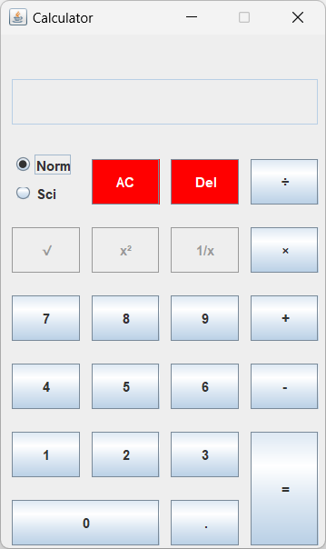
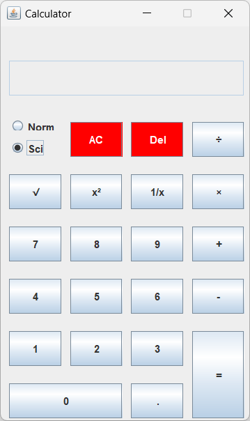

# Calculator Application

A basic calculator application created using **Java Swing**.

## Requirements
* Java version 8 or higher. Use any of the latest JDKs like the [Oracle JDK](https://www.oracle.com/in/java/technologies/downloads/).

* Either fork/clone the repo locally and run [`Calculator.java`](https://github.com/ThejusGSajan/Calculator/blob/main/src/main/com/thxjxs/calculator/Calculator.java).

## Limitations (feel free to contribute)
* Can currently execute only 2 operand operations.
* Very few operations are included.

## Screenshots
| Normal Mode  | Scientific Mode|
|  :--------:  |    :-------:   |
| | |

